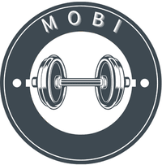

#  Mobi App – Personalized Rehabilitation Experience

**Mobi App** is a specialized iOS application designed to support injured individuals in physiotherapy rehabilitation. Built to address the challenge of maintaining consistent rehab routines, Mobi provides comprehensive exercise logging and progress tracking to help users stay on track with their physiotherapy and return to normal life with confidence.

 <!-- Add your app banner here -->

## 🎯 Challenge Statement

**Supporting injured individuals in physiotherapy rehabilitation** through an innovative mobile solution that provides:
- **Exercise Logging**: Comprehensive tracking of prescribed physiotherapy exercises
- **Progress Monitoring**: Real-time progress tracking to maintain motivation and adherence
- **Rehabilitation Support**: Keeping users on track with their rehab routine to return to normal life

## 🌟 Mission

Bridging the gap between physiotherapy sessions by providing injured individuals with the tools and motivation needed to maintain consistent rehabilitation routines, ultimately accelerating their journey back to normal life.

## ✨ Key Features

### 📝 Exercise Logging & Management
- **Exercise Library**: Access to common physiotherapy exercises with instructions
- **Session Recording**: Track exercise duration, sets, reps, and difficulty levels
- **Notes & Observations**: Add personal notes about pain, difficulty, or improvements

## 📱 Screenshots

<table>
  <tr>
    <td></td>
    <td></td>
    <td></td>
  </tr>
  <tr>
    <td align="center">Home</td>
    <td align="center">Exercise Plan</td>
    <td align="center">Exercise Logging</td>
  </tr>
</table>

## 🏆 Academic Recognition

**Course**: 42889 – Application Development in the iOS Environment  
**Institution**: University of Technology Sydney (UTS)  
**Session**: Autumn 2025 – Assignment 3  

### Learning Outcomes Achieved
- Advanced SwiftUI development and architecture patterns
- User experience design for accessibility and healthcare

## 👥 Development Team

**Team Members:**
- **Yodchai Kovavinthaweewat** – Student ID: 25087925

- **Harsha Varthini Maniraj** – Student ID: 25379328

- **Hsin Chen** – Student ID: 25033349

---

**"Empowering recovery through technology, one step at a time."** 🚀

*Developed by UTS Students for Assignment 3 - iOS Application Development*
